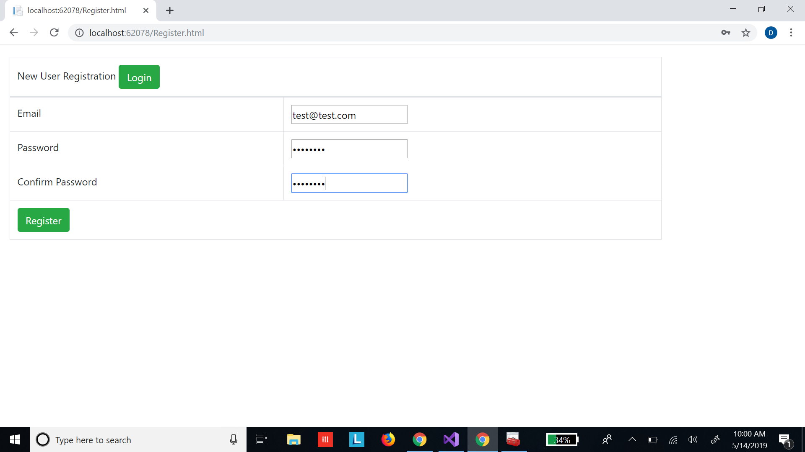
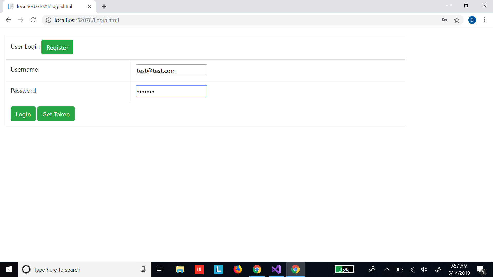
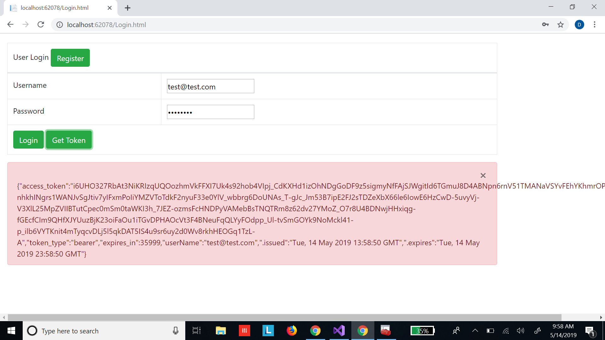
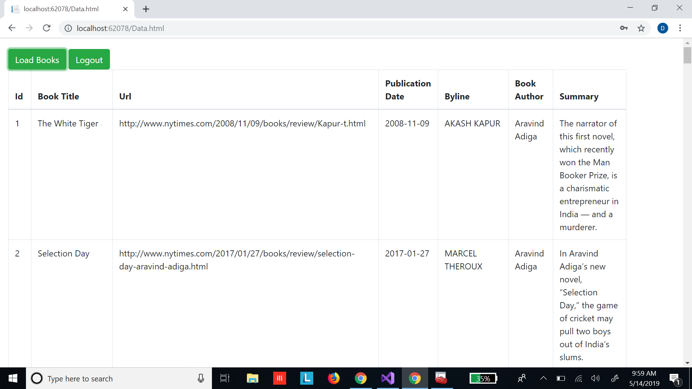

## ASP.NET-BookReview-Web-API

* This is an API to get the reviews of the New York Times Best Selling Books.
* It is an ASP.NET Web API which implements OData protocol.
* The data is backed in SQL Server Database using SQLExpress, also I've used Entity Framework Code First approcah to migrate my models to the database.
* Authentication is done using ASP.NET identity based on Owin middleware where each user will have to register and ask for a token to access the API.
* You can add data to the API using Reviews.py python script.

#### Register a user

#### Enter username and password to either login and get the data from API or to get the token associated with the user

#### If you click get token, you get the token associated with the user.

#### If you click login, you get data from the API.

